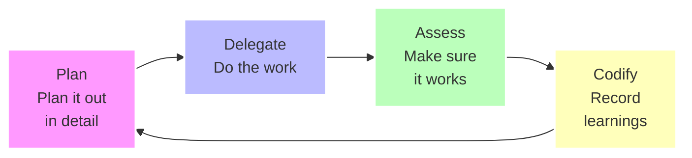

# Every Marketplace (Node.js Fork)

> **🚀 Node.js Developer Edition** — This is a fork optimized for Node.js and TypeScript developers. All Ruby/Rails patterns have been replaced with modern Node.js equivalents using Express, Fastify, Hono, and TypeScript best practices.

The official **Node.js Edition** of the Every marketplace, maintained by [Hosni Mohamed](https://github.com/meethosny). Currently featuring the js-compound-engineering plugin.

## Quick Start

### Standard Installation
Run Claude and add the marketplace:

```bash
/plugin marketplace add https://github.com/meethosny/js-compound-engineering
```

Then install the plugin:

```bash
/plugin install js-compound-engineering
```

### One-Command Installation
Use the [Claude Plugins CLI](https://claude-plugins.dev) to skip the marketplace setup:

```bash
npx claude-plugins install https://github.com/meethosny/js-compound-engineering
```

This automatically adds the marketplace and installs the plugin in a single step.

### Factory (Droid) quick start

1) Install Droid (Factory).

```bash
bunx droid-factory
```

What this does: copies Claude Code marketplace commands/agents/subagents and converts them to Droid format.

Next:
- Start Droid
- In Settings, enable Sub-agents

You're done: use this source from Droid. You don't need to add it in Claude Code anymore.

---

# js-compound-engineering Plugin

AI-powered development tools that get smarter with every use. **Includes 28 specialized agents, 24 commands, 15 skills, and 1 MCP server.**

> **Note:** All components are prefixed with `js-` to avoid conflicts with the original `compound-engineering` plugin.

Transform how you plan, build, and review code using AI-powered tools that systematically improve your development workflow.

## What Is Compounding Engineering?

**Each unit of engineering work should make subsequent units of work easier—not harder.**

Traditional development accumulates technical debt. Every feature adds complexity. Every change increases maintenance burden. The codebase becomes harder to work with over time.

Compounding engineering inverts this. Each feature you build:
- Documents patterns for the next feature
- Creates reusable components that accelerate future work
- Establishes conventions that reduce decision fatigue
- Codifies knowledge that compounds across the team

This plugin provides the tools to make compounding engineering practical. It transforms vague ideas into structured plans, executes those plans systematically, and ensures every change meets your quality bar before merging.



## How It Works

The plugin follows a three-step workflow that makes development compound:

### 1. Plan: Turn Ideas Into Structured Issues

Use `/js-workflows:plan` to transform feature descriptions into comprehensive GitHub issues.

**What it does:**
- Researches your codebase to find similar patterns and conventions
- Analyzes framework documentation and best practices
- Creates detailed acceptance criteria and implementation plans
- Generates code examples that follow your existing patterns

**The result:** Issues that make implementation easier because they've already done the research and planning work.

### 2. Work: Execute Plans Systematically

Use `/js-workflows:work` to execute work plans with isolated worktrees and systematic task tracking.

**What it does:**
- Creates isolated git worktrees for clean development
- Breaks down plans into trackable todos
- Executes tasks systematically with continuous validation
- Runs tests and quality checks after each change

**The result:** Features built correctly the first time, with full test coverage and no regressions.

### 3. Review: Ensure Quality Before Merging

Use `/js-workflows:review` to perform exhaustive multi-agent code reviews.

**What it does:**
- Checks out your PR in an isolated worktree for deep analysis
- Runs 12+ specialized review agents in parallel
- Identifies security issues, performance problems, and architectural concerns
- Creates trackable todos for every finding

**The result:** Code that meets your quality bar and documents learnings for future work.

## Practical Examples

### Example: Plan a New Feature

```bash
# Create a detailed GitHub issue from a feature description
claude /js-workflows:plan "Add user profile avatars with S3 upload and automatic resizing"
```

The command will:
1. Research how your codebase handles file uploads
2. Find similar features in your repository
3. Check framework documentation for best practices
4. Generate a complete issue with acceptance criteria, technical approach, and code examples

You can choose detail levels:
- **Minimal:** Quick issues for simple features
- **More:** Standard issues with technical considerations
- **A lot:** Comprehensive issues for major features

### Example: Execute a Work Plan

```bash
# Execute a plan document systematically
claude /js-workflows:work path/to/plan.md
```

The command will:
1. Create a feature branch and isolated worktree
2. Analyze the plan and create a comprehensive todo list
3. Execute each task systematically
4. Run tests after every change
5. Create a pull request when complete

### Example: Review a Pull Request

```bash
# Review the latest PR
claude /js-workflows:review

# Review a specific PR
claude /js-workflows:review 123

# Review from a GitHub URL
claude /js-workflows:review https://github.com/user/repo/pull/123
```

The command will:
1. Check out the PR in an isolated worktree
2. Run 12+ specialized review agents in parallel:
   - Language-specific reviewers (Node.js, TypeScript, Python)
   - Security sentinel for vulnerability scanning
   - Performance oracle for optimization opportunities
   - Architecture strategist for design review
   - Data integrity guardian for database concerns
3. Present findings one by one for triage
4. Create todos for approved findings

## All Commands

The plugin includes 24 commands for different stages of development:

### `/js-workflows:plan [feature description]`
Creates detailed GitHub issues from feature descriptions. Includes research, acceptance criteria, and implementation guidance.

### `/js-workflows:work [plan file]`
Executes work plans systematically with worktrees, todos, and continuous validation.

### `/js-workflows:review [PR number or URL]`
Performs exhaustive multi-agent code reviews with security, performance, and architecture analysis.

### `/js-workflows:compound`
Documents solved problems to compound team knowledge.

### `/js-workflows:brainstorm`
Explores what to build before diving into implementation.

### `/js-triage`
Presents findings one by one for review and converts approved items into trackable todos.

### `/js-resolve_todo_parallel`
Resolves multiple todos in parallel with systematic execution and quality checks.

### `/js-generate_command`
Generates new Claude Code commands from descriptions.

### `/js-lfg`
Full autonomous engineering workflow (plan → deepen → work → review → test → video).

## All Agents

The plugin includes 28 specialized agents that provide expertise in different areas. All agents are prefixed with `js-`:

### Code Review Specialists
- **js-modern-nodejs-reviewer:** Modern Node.js review with minimalist, pragmatic approach (TJ Holowaychuk + Matteo Collina + Yusuke Wada style)
- **js-kieran-nodejs-reviewer:** Node.js code review with strict conventions
- **js-kieran-typescript-reviewer:** TypeScript code review with type safety and best practices
- **js-kieran-python-reviewer:** Python code review with focus on clarity and conventions
- **js-code-simplicity-reviewer:** Identifies opportunities to simplify complex code
- **js-agent-native-reviewer:** Verifies agent-native architecture patterns (DSPy, structured prompting)
- **js-data-integrity-guardian:** Database design review and data consistency checks
- **js-data-migration-expert:** Validates ID mappings and data migration plans
- **js-deployment-verification-agent:** Pre-deployment checklists and verification tasks
- **js-julik-frontend-races-reviewer:** Spots race conditions in frontend code

### Quality Guardians
- **js-security-sentinel:** Comprehensive security audits and vulnerability detection
- **js-performance-oracle:** Performance analysis and optimization recommendations

### Architecture & Patterns
- **js-architecture-strategist:** System design review and architectural guidance
- **js-pattern-recognition-specialist:** Identifies patterns and suggests improvements

### Research & Analysis
- **js-repo-research-analyst:** Analyzes repository patterns and conventions
- **js-best-practices-researcher:** Researches best practices for technologies
- **js-framework-docs-researcher:** Fetches relevant framework documentation
- **js-git-history-analyzer:** Analyzes git history for context and patterns
- **js-learnings-researcher:** Searches documented learnings for institutional knowledge

### Workflow & Communication
- **js-sorhus-readme-writer:** Creates READMEs following Sindre Sorhus style for npm packages
- **js-every-style-editor:** Edits content to match Every's style guide
- **js-pr-comment-resolver:** Systematically resolves PR review comments
- **js-lint:** Runs ESLint, Prettier, and npm audit for JavaScript/TypeScript quality
- **js-bug-reproduction-validator:** Systematically reproduces and validates bug reports
- **js-spec-flow-analyzer:** Analyzes user flows and identifies gaps in specifications

### Design
- **js-design-implementation-reviewer:** Verifies UI implementations match Figma designs
- **js-design-iterator:** Iteratively refines UI through systematic design iterations
- **js-figma-design-sync:** Synchronizes web implementations with Figma designs

## Why This Makes Development Compound

Traditional development tools help you work faster. Compounding engineering tools make future work easier.

**Every `/js-workflows:plan` you create:**
- Documents patterns that inform the next plan
- Establishes conventions that reduce planning time
- Builds institutional knowledge

**Every `/js-workflows:work` execution:**
- Creates reusable components
- Refines your testing approach
- Improves your development process

**Every `/js-workflows:review` you run:**
- Catches issues earlier
- Documents learnings for the team
- Raises the quality bar systematically

Over time, you're not just building features—you're building a development system that gets better with each use.

## Philosophy in Practice

The plugin embodies these compounding engineering principles:

**Prefer duplication over complexity:** Simple, clear code that's easy to understand beats complex abstractions. The js-kieran-nodejs-reviewer enforces this strictly.

**Document as you go:** Every command generates documentation—issues, todos, review findings—that makes future work easier.

**Quality compounds:** High-quality code is easier to modify. The multi-agent review system ensures every change meets your quality bar.

**Systematic beats heroic:** Consistent processes beat individual heroics. The `/js-workflows:work` command executes plans systematically, with continuous validation.

**Knowledge should be codified:** Learnings should be captured and reused. The research agents analyze your codebase to apply your own patterns back to you.

## Getting Started

1. Install the plugin using one of the methods above
2. Run `/js-workflows:plan` on your next feature idea
3. Use `/js-workflows:work` to execute the plan
4. Run `/js-workflows:review` before merging
5. Repeat, and watch your development process compound

Each cycle makes the next cycle easier. That's compounding engineering.

## Learn More

[Read the full story](https://every.to/source-code/my-ai-had-already-fixed-the-code-before-i-saw-it) about how compounding engineering transforms development workflows.