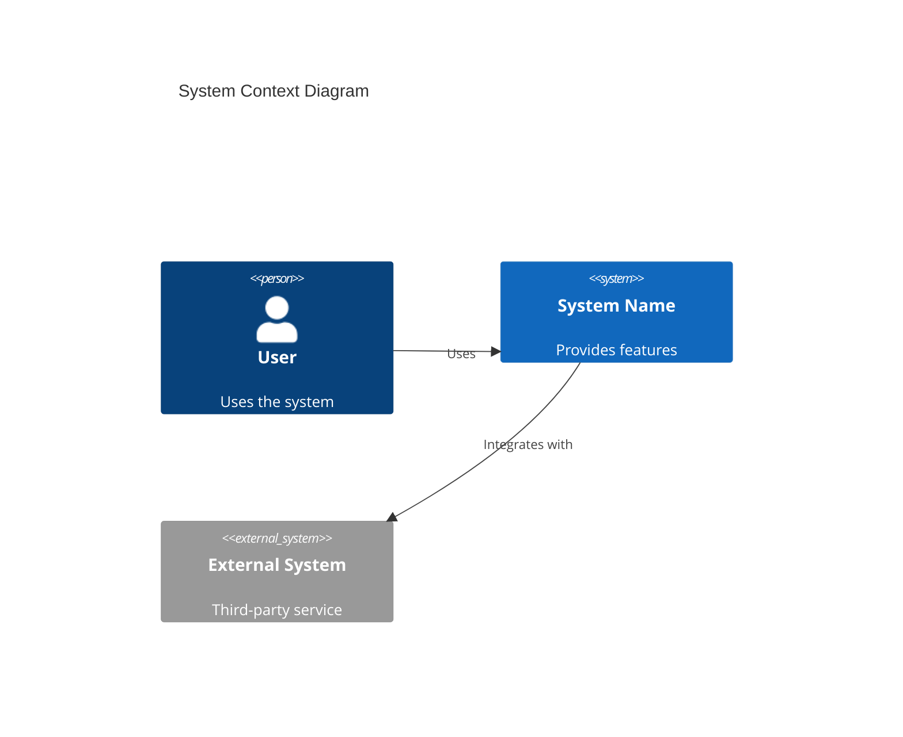
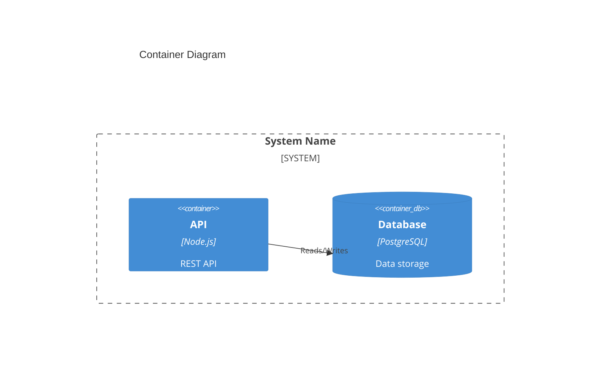

# C4 Architecture Documentation Plugin

Generate comprehensive C4 architecture documentation for your codebase using a bottom-up analysis approach.

## Installation

```bash
claude /plugin install compound-c4-architecture
```

## Quick Start

```bash
# Generate C4 documentation for your repository
/doc:c4
```

This creates complete C4 documentation in `docs/c4/` following the [official C4 model](https://c4model.com).

## What Is C4?

The C4 model provides four levels of abstraction for software architecture:

1. **Context** - System relationships with users and external systems
2. **Container** - High-level technology choices and deployment units
3. **Component** - Logical components within containers
4. **Code** - Implementation details (classes, functions, modules)

## Components

### Agents (4)

| Agent | Description |
|-------|-------------|
| `c4-context` | Create high-level Context documentation with personas and user journeys |
| `c4-container` | Map components to deployment containers with API specs |
| `c4-component` | Synthesize code docs into logical component boundaries |
| `c4-code` | Document code at the most granular level (functions, classes) |

### Commands (1)

| Command | Description |
|---------|-------------|
| `/doc:c4` | Generate full C4 architecture documentation for a repository |

## Workflow

The `/doc:c4` command orchestrates all four agents in a bottom-up approach:

```
Code Level → Component Level → Container Level → Context Level
```

1. **Phase 1**: Analyze all subdirectories bottom-up, creating `c4-code-*.md` files
2. **Phase 2**: Synthesize code docs into components with interface definitions
3. **Phase 3**: Map components to containers with OpenAPI specs
4. **Phase 4**: Create system context with personas, features, and user journeys

## Output Structure

```
docs/c4/
├── c4-code-*.md           # Code-level docs (one per directory)
├── c4-component-*.md      # Component-level docs (one per component)
├── c4-component.md        # Master component index
├── c4-container.md        # Container-level deployment architecture
├── c4-context.md          # System context with personas and journeys
└── apis/                  # OpenAPI specifications
    └── [container]-api.yaml
```

## Diagram Examples

### Context Diagram



### Container Diagram



## When to Use

- **New team members** - Onboard developers with visual architecture overview
- **Architecture reviews** - Document current state before major changes
- **Technical documentation** - Generate living architecture docs from code
- **Stakeholder communication** - Context diagrams for non-technical audiences

## Philosophy

According to the [C4 model](https://c4model.com/diagrams):

> You don't need to use all 4 levels - the system context and container diagrams are sufficient for most software development teams.

This plugin generates all levels for completeness. Teams can choose which levels to maintain.

## Related

- [C4 Model Official Site](https://c4model.com)
- [Mermaid C4 Diagrams](https://mermaid.js.org/syntax/c4.html)
